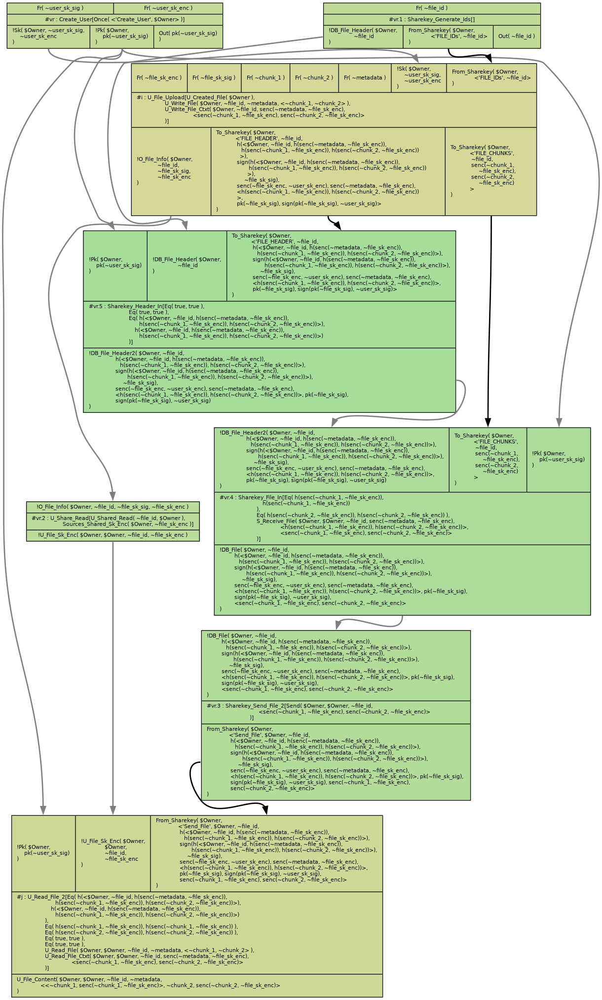
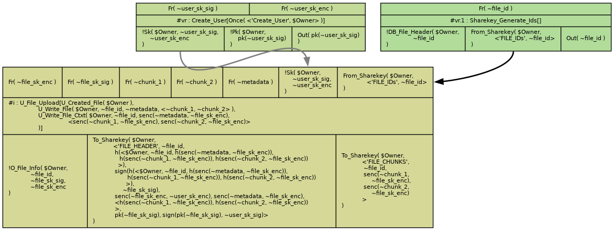
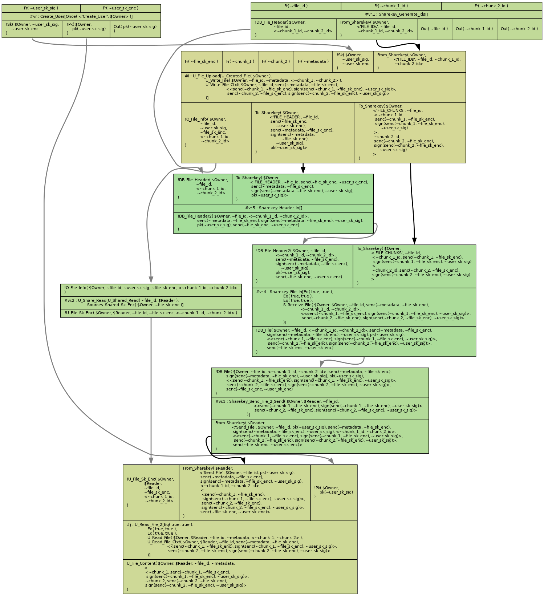
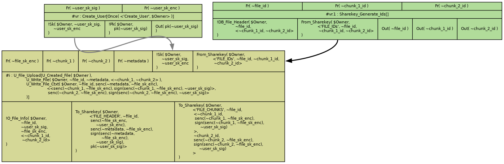
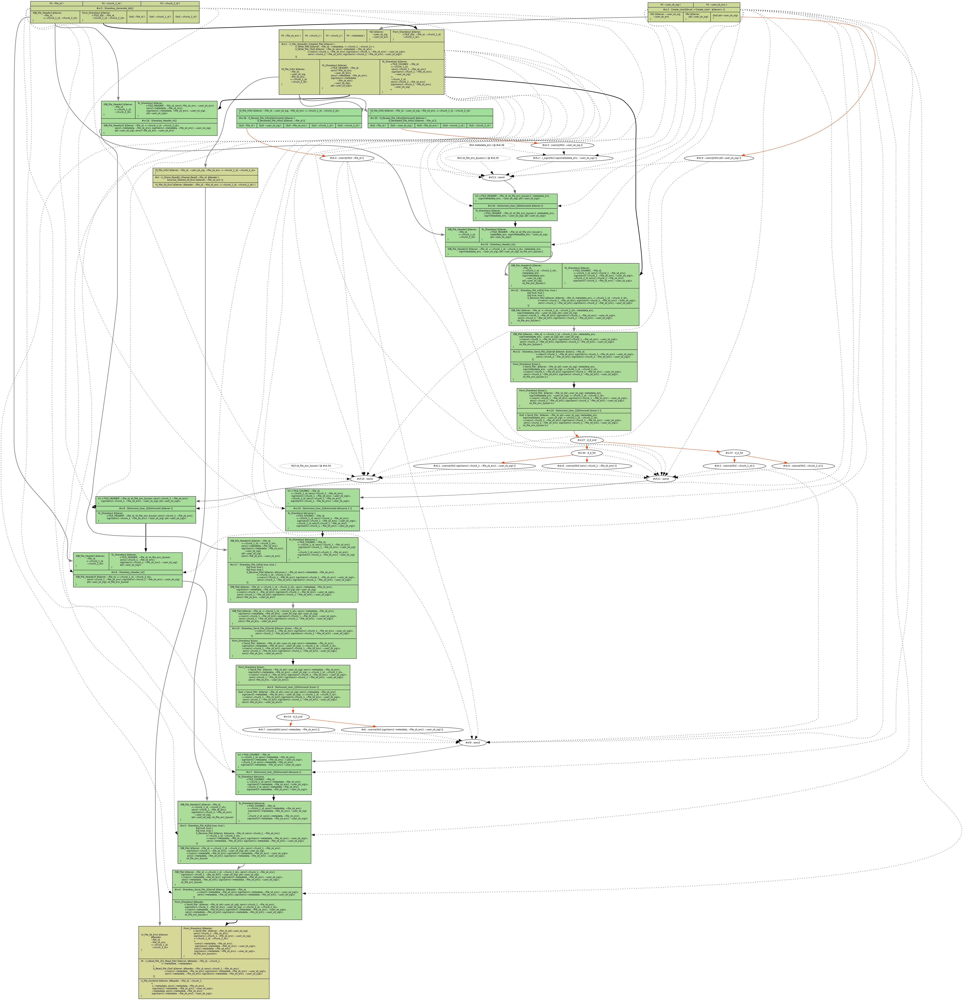
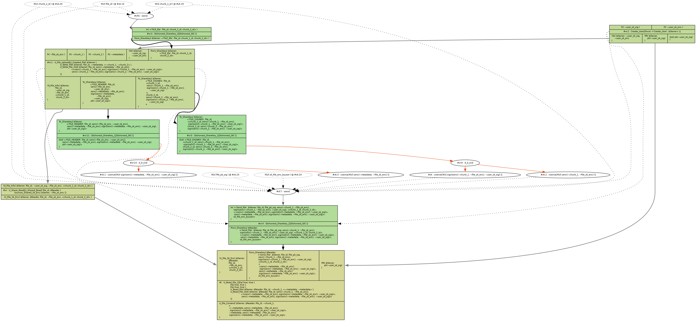
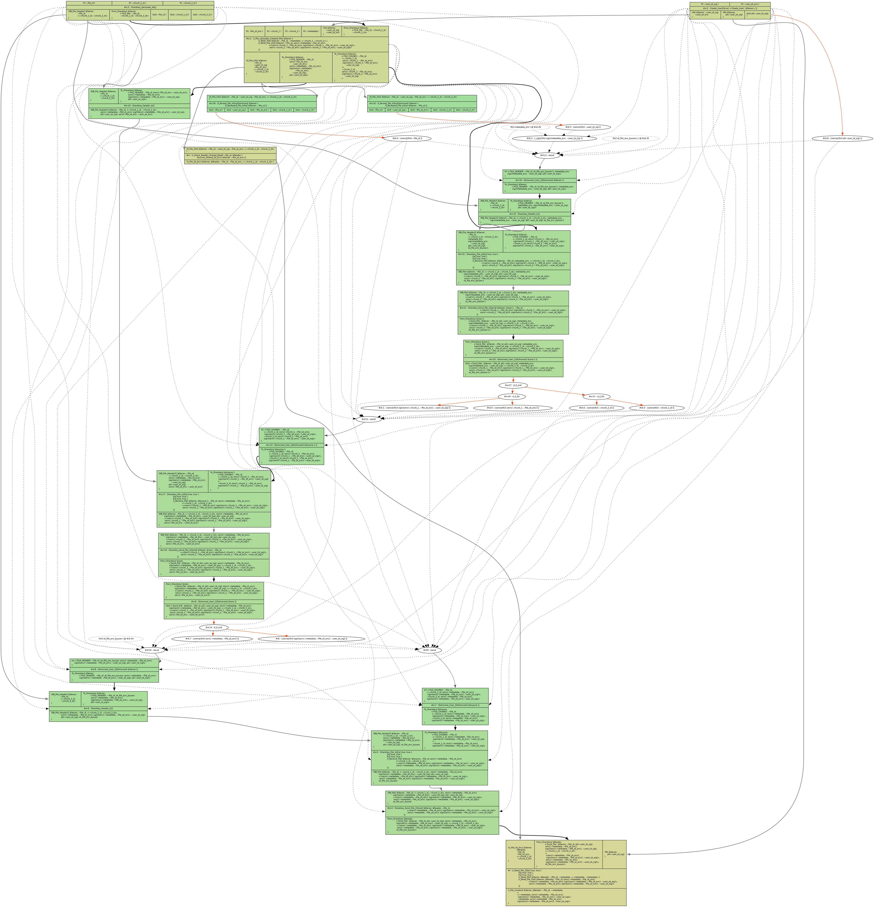
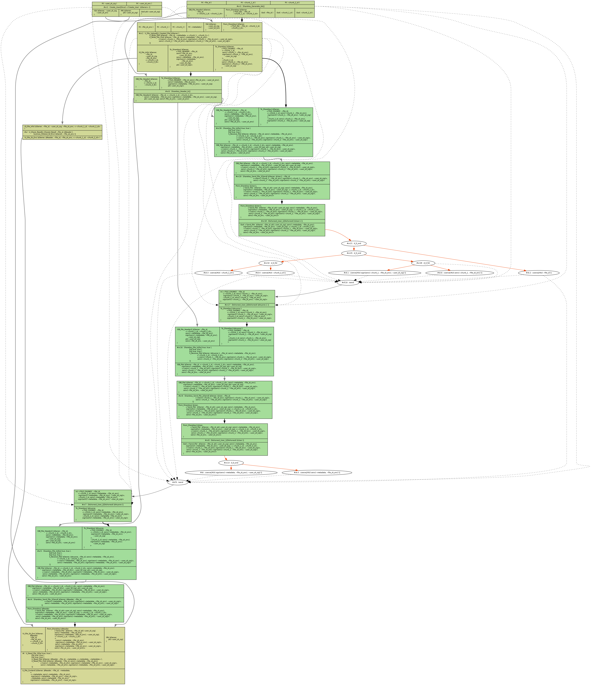
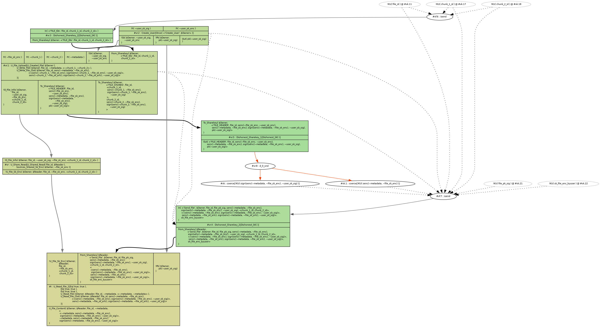

# Tamarin
This subfolder contains the Tamarin code used to model and verify the security properties of Sharekey's protocol.

## Usage
1. [Install Tamarin](https://tamarin-prover.github.io/manual/book/002_installation.html)
2. Go into this directory and run `tamarin-prover interactive .`
3. Open the tamarin web interface and manually step through proofs

## Graphs
- **New_Functionality-Read-File**
  
- **New_Functionality-Write-File**
  
- **Old_Functionality-Read-File**
  
- **Old_Functionality-Write-File**
  
- **Old_Integrity-Metadata-Dishonest-Owner-U1**
  
- **Old_Integrity-Metadata-Dishonest-Sharekey-U1**
  
- **Old_Integrity-Plaintext-Dishonest-Owner-U1**
  
- **Old_Integrity-Plaintext-Dishonest-Reader-U1**
  
- **Old_Integrity-Plaintext-Dishonest-Sharekey-U1**
  
